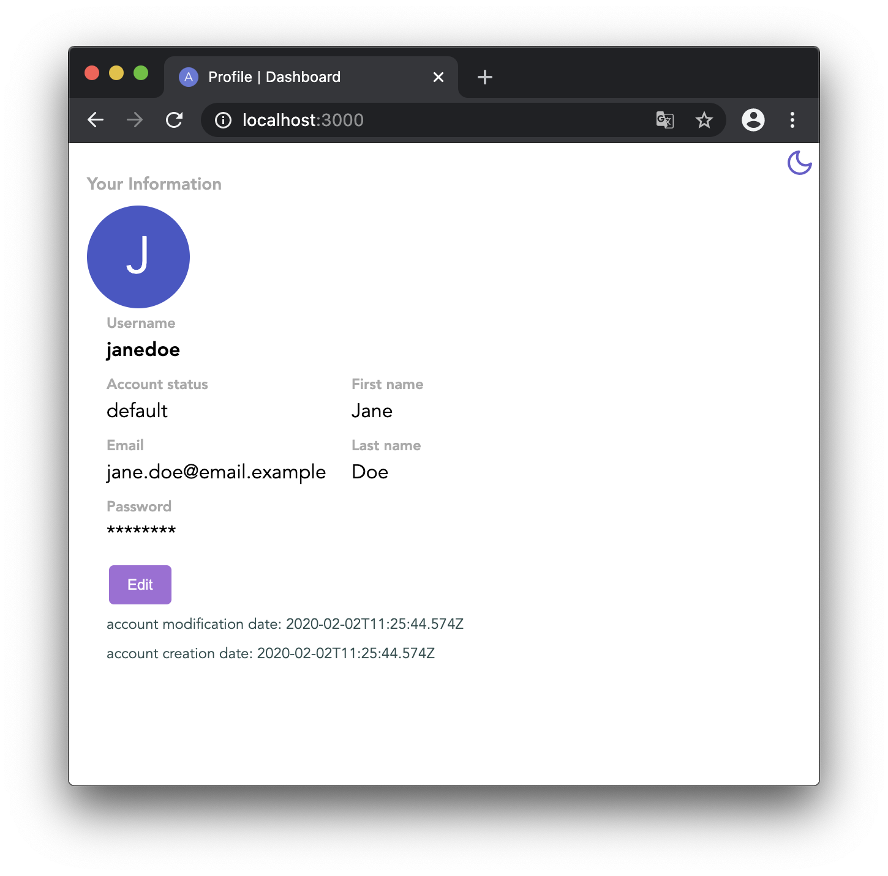

# Auth Dashboard



> This is intended to be used as a submodule inside of [this](https://git.jannik.ml/jannik/auth) project.

This is the second iteration of the auth / accounts dashboard. For non-admin users this looks pretty much the same as always but the for admins it now allows to edit other users, generate register tokens and much more. This was previously only possible via APIs, the dashboard capabilities just weren't there yet. This new dashboard changes this.

Instead of using plain javascript this frontend is now powered by react.

## Installation

```sh
git clone https://git.jannik.ml/jannik/auth-react-dashboard dashboard # or wherever this is hosted
cd dashboard
npm install
npm start
```

> This project was created using [Create React App](https://github.com/facebook/create-react-app).
